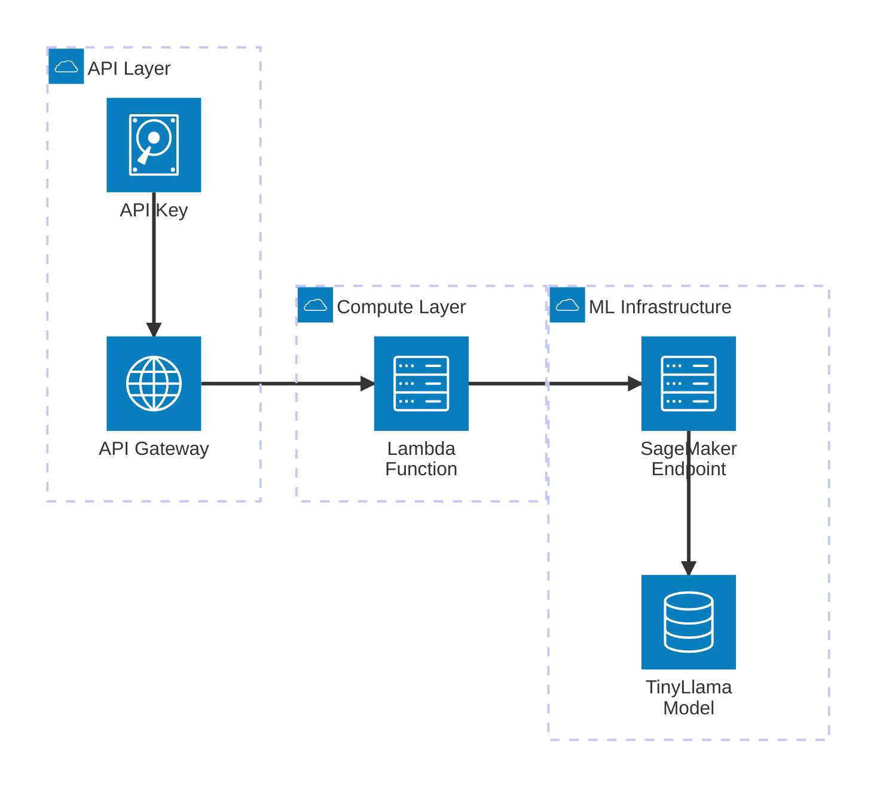
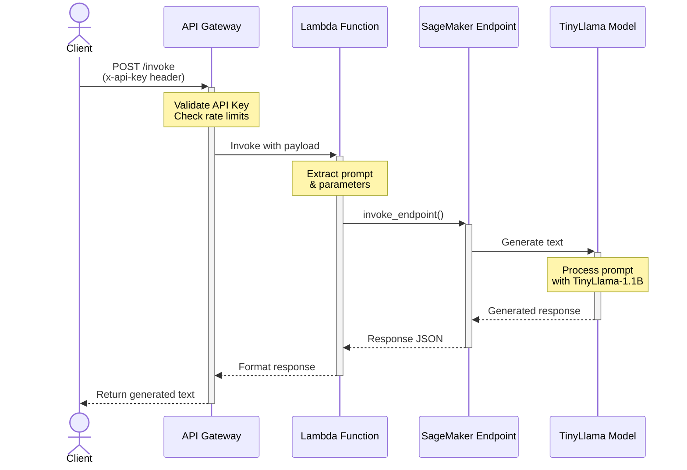

# SageMaker Real-Time LLM Endpoint

[](https://github.com/bayesjumping/slm_sagemaker/actions/workflows/test-and-lint.yml)

Deploy the **TinyLlama/TinyLlama-1.1B-Chat-v1.0** model as a SageMaker Real-Time Inference Endpoint with API Gateway integration and API key authentication.

> **⚠️ COST WARNING**: This deployment uses a real-time ml.g5.xlarge GPU instance that runs 24/7 and costs approximately **$1.41/hour (~$1,015/month)**. The endpoint continues billing even when not processing requests. The ml.g5.xlarge instance has 24GB GPU memory (NVIDIA A10G). Remember to destroy the stack when not in use: `make destroy PROFILE=ml-sage REGION=eu-west-2`

## Architecture

### System Components

The following diagram illustrates the AWS components that make up this real-time LLM solution:



**Component Overview:**
- **API Gateway**: REST API with `/invoke` endpoint for client requests
- **API Key**: Authenticates and rate-limits API requests (50 req/sec, 10k/day)
- **Lambda Function**: Processes requests and invokes the SageMaker endpoint
- **SageMaker Endpoint**: Real-time inference endpoint on ml.g5.xlarge GPU instance (24GB GPU memory, NVIDIA A10G)
- **TinyLlama-1.1B Model**: HuggingFace TGI container serving the language model

### Request Flow

The sequence diagram below shows how a request flows through the system from an API client to the LLM model and back:



**Request Flow Steps:**
1. **Client Authentication**: Client sends POST request to `/invoke` with `x-api-key` header
2. **Rate Limiting**: API Gateway validates the API key and checks throttling limits
3. **Lambda Invocation**: API Gateway triggers the Lambda function with the request payload
4. **Request Processing**: Lambda extracts the prompt and generation parameters (temperature, max_tokens, etc.)
5. **SageMaker Inference**: Lambda calls `invoke_endpoint()` on the SageMaker runtime
6. **Instance Ready**: Real-time endpoint is always running (no cold starts after initial deployment)
7. **Text Generation**: The TinyLlama model processes the prompt and generates a response
8. **Response Formatting**: Lambda formats the TGI output and returns it to the client

This CDK project deploys:
- **SageMaker Real-Time Endpoint** running TinyLlama-1.1B-Chat with TGI (Text Generation Inference) on ml.g5.xlarge
- **API Gateway** REST API with Lambda integration
- **Lambda function** to invoke the SageMaker endpoint
- **API Key authentication** with usage plans and throttling

## Prerequisites

- Python 3.11+
- Node.js 20+ (for AWS CDK CLI)
- AWS CLI configured with SSO profile `ml-sage`
- AWS CDK CLI installed (`npm install -g aws-cdk`)

## Quick Start

### 1. Clone and Setup

```bash
git clone <repository-url>
cd slm_sagemaker
python3 -m venv .venv
source .venv/bin/activate  # On Windows: .venv\Scripts\activate.bat
make install
```

### 2. AWS Authentication

Log in to AWS SSO with your profile:

```bash
# Using Makefile (recommended)
make sso-login PROFILE=ml-sage

# Or directly
aws sso login --profile ml-sage
```

### 3. Bootstrap CDK (first time only)

Bootstrap CDK in your target region. This is required once per account/region combination:

```bash
# Deploy to US East (N. Virginia) - us-east-1
make bootstrap PROFILE=ml-sage REGION=us-east-1

# Deploy to London - eu-west-2
make bootstrap PROFILE=ml-sage REGION=eu-west-2

# Deploy to any other region
make bootstrap PROFILE=ml-sage REGION=<your-region>
```

### 4. Deploy the Stack

Deploy the SageMaker endpoint and API Gateway:

```bash
# Deploy to US East (N. Virginia)
make deploy PROFILE=ml-sage REGION=us-east-1

# Deploy to London
make deploy PROFILE=ml-sage REGION=eu-west-2

# Deploy to any other region
make deploy PROFILE=ml-sage REGION=<your-region>
```

**Common AWS Regions:**
- `us-east-1` - US East (N. Virginia)
- `us-west-2` - US West (Oregon)
- `eu-west-1` - Europe (Ireland)
- `eu-west-2` - Europe (London)
- `eu-central-1` - Europe (Frankfurt)
- `ap-southeast-1` - Asia Pacific (Singapore)

The deployment will output:
- **API Gateway URL** - Base URL for the API
- **Invoke Endpoint** - Full URL to invoke the model
- **API Key ID** - Use this to retrieve your API key
- **Command to retrieve API key** - Copy-paste ready
- **Example curl command** - Ready to use after adding your API key

### 5. Retrieve API Key

After deployment completes, use the command shown in the output:

```bash
aws apigateway get-api-key --api-key <API_KEY_ID> --include-value --profile ml-sage --region <your-region>
```

Example for London deployment:
```bash
aws apigateway get-api-key --api-key abc123xyz --include-value --profile ml-sage --region eu-west-2
```

## Usage

### Invoke the Model

```bash
curl -X POST https://<api-id>.execute-api.<region>.amazonaws.com/prod/invoke \
  -H "Content-Type: application/json" \
  -H "x-api-key: YOUR_API_KEY" \
  -d '{
    "prompt": "What is the capital of France?",
    "parameters": {
      "max_new_tokens": 512,
      "temperature": 0.7,
      "top_p": 0.9
    }
  }'
```

### Response Format

```json
{
  "generated_text": "The capital of France is Paris...",
  "prompt": "What is the capital of France?",
  "parameters": {
    "max_new_tokens": 512,
    "temperature": 0.7,
    "top_p": 0.9,
    "do_sample": true
  }
}
```

## Project Structure

```
slm_sagemaker/
├── slm_sagemaker/
│   ├── constructs/
│   │   ├── sagemaker_construct.py    # SageMaker real-time endpoint
│   │   └── api_construct.py           # API Gateway + Lambda
│   └── slm_sagemaker_stack.py         # Main CDK stack
├── lambda/
│   └── invoke_sagemaker/
│       └── handler.py                  # Lambda function
├── tests/
│   └── unit/
│       ├── test_sagemaker_construct.py
│       ├── test_api_construct.py
│       └── test_slm_sagemaker_stack.py
├── .github/
│   └── workflows/
│       └── test-and-lint.yml           # CI/CD pipeline
├── config.py                           # Typed deployment configuration
├── Makefile                            # Build automation
├── requirements.txt                    # Python dependencies
└── requirements-dev.txt                # Development dependencies
```

## Development

### Run Tests

```bash
# Unit tests
pytest tests/unit/ -v

# With coverage
pytest tests/unit/ -v --cov=slm_sagemaker --cov-report=term-missing
```

### Linting

```bash
# Check code style
ruff check .
black --check .

# Auto-fix
ruff check . --fix
black .
```

### CDK Commands

```bash
make synth PROFILE=ml-sage    # Synthesize CloudFormation
make diff PROFILE=ml-sage     # Show deployment changes
make destroy PROFILE=ml-sage  # Destroy stack
```

## Makefile Targets

```bash
make help          # Show all available targets
make sso-login     # Log in to AWS SSO
make bootstrap     # Bootstrap CDK in your account
make deploy        # Deploy the stack
make diff          # Show changes
make synth         # Synthesize CloudFormation
make destroy       # Destroy the stack
```

## Configuration

### Endpoint Type and Model Configuration

Configure deployment settings in [config.py](config.py) using typed dataclasses:

```python
from config import CONFIG, EndpointType

# Change endpoint type
CONFIG.endpoint.type = EndpointType.REAL_TIME  # or EndpointType.SERVERLESS

# Configure real-time endpoint
CONFIG.endpoint.real_time.instance_type = "ml.g5.xlarge"
CONFIG.endpoint.real_time.initial_instance_count = 1

# Configure serverless endpoint
CONFIG.endpoint.serverless.memory_size_in_mb = 6144
CONFIG.endpoint.serverless.max_concurrency = 10

# Change model
CONFIG.model.hf_model_id = "TinyLlama/TinyLlama-1.1B-Chat-v1.0"
```

**Configuration Classes:**
- `EndpointType`: Enum with `REAL_TIME` and `SERVERLESS` values
- `DeploymentConfig`: Complete deployment configuration with type safety
- `ModelConfig`: Model name and HuggingFace model ID
- `RealTimeEndpointConfig`: Instance type and count
- `ServerlessEndpointConfig`: Memory size and max concurrency

**Endpoint Types:**
- `EndpointType.REAL_TIME`: Always-on endpoint with dedicated instances (billed per hour, no cold starts)
- `EndpointType.SERVERLESS`: Scale-to-zero endpoint (billed per invocation, has cold starts)

**Real-Time Endpoint Configuration:**
- `instance_type`: GPU instance type (ml.g5.xlarge, ml.g5.2xlarge, ml.g5.12xlarge, etc.)
- `initial_instance_count`: Number of instances (1-10+)

**Real-Time Instance Types:**
- `ml.g5.xlarge`: 4 vCPUs, 24GB GPU memory (A10G), ~$1.41/hour ⭐ **Current**
- `ml.g4dn.xlarge`: 4 vCPUs, 16GB GPU memory (Tesla T4), ~$0.736/hour
- `ml.g4dn.2xlarge`: 8 vCPUs, 32GB GPU memory (Tesla T4), ~$1.05/hour
- `ml.g5.2xlarge`: 8 vCPUs, 24GB GPU memory (A10G), ~$1.52/hour

**Serverless Endpoint Configuration:**
- `memory_size_in_mb`: Memory allocation (1024, 2048, 3072, 4096, 5120, 6144 MB)
- `max_concurrency`: Maximum concurrent invocations (1-200)

**Serverless Pricing:**
- Billed per invocation duration (no charge when idle)
- ~$0.00002 per second of inference with 6GB memory
- Approximately 60-70% cheaper for intermittent usage
- Has cold start latency (~10-60 seconds) when scaling from zero

**Model Configuration:**

**HuggingFace Model Selection:**
Change the model in [config.py](config.py) to deploy different models:

```python
from config import CONFIG

# Examples of popular models
CONFIG.model.name = "TinyLlama-1-1B-Chat"  # Display name
CONFIG.model.hf_model_id = "TinyLlama/TinyLlama-1.1B-Chat-v1.0"  # HuggingFace ID
```

Popular model options:
- `"TinyLlama/TinyLlama-1.1B-Chat-v1.0"` - Small, efficient 1.1B model (current)
- `"NousResearch/Hermes-3-Llama-3.1-8B"` - High quality 8B model
- `"meta-llama/Llama-2-7b-chat-hf"` - Meta's Llama 2 model (requires HF token)
- `"mistralai/Mistral-7B-Instruct-v0.2"` - Mistral 7B instruction model

### API Gateway

Throttling and quota limits in [slm_sagemaker/constructs/api_construct.py](slm_sagemaker/constructs/api_construct.py):

- `rate_limit`: 50 requests/second
- `burst_limit`: 100 requests
- `quota`: 10,000 requests/day

## Cost Considerations

**Endpoint Type Comparison:**

| Aspect | Real-Time | Serverless |
|--------|-----------|------------|
| **Billing** | Per hour (always on) | Per invocation (pay-per-use) |
| **Cold Starts** | None (after initial deploy) | 10-60 seconds when scaling from zero |
| **Best For** | Continuous usage, low latency | Intermittent usage, dev/test |
| **Cost Example** | $530-756/month (24/7) | ~60-70% cheaper for <10 req/day |

**Real-Time Endpoint Costs:**
- ml.g4dn.xlarge: ~$0.736/hour (~$530/month)
- ml.g4dn.2xlarge: ~$1.05/hour (~$756/month)
- Billed continuously while endpoint is running
- No cold starts after initial deployment

**Serverless Endpoint Costs:**
- ~$0.00002 per second of inference with 6GB memory
- No charge when idle (scales to zero)
- Ideal for infrequent usage patterns (<100 requests/day)
- Cold start delay of 10-60 seconds when inactive

**API Gateway:**
- $3.50 per million API calls
- Data transfer charges apply

**Lambda:**
- Minimal cost for invocation wrapper
- Included in AWS Free Tier (1M requests/month)

**Estimated monthly cost:** 
- **Real-Time (ml.g5.xlarge)**: ~$1,015/month for 24/7 operation (current)
- **Real-Time (ml.g4dn.xlarge)**: ~$530/month for 24/7 operation
- **Real-Time (ml.g4dn.2xlarge)**: ~$756/month for 24/7 operation
- **Serverless**: Variable, ~$50-150/month for moderate usage

**Cost Optimization:**
- **Use serverless for dev/test**: Set `CONFIG.endpoint.type = EndpointType.SERVERLESS` in [config.py](config.py)
- **Use serverless for low traffic**: <100 requests/day = significant savings
- **Delete when not in use**: `make destroy PROFILE=ml-sage REGION=eu-west-2` (most effective)
- **ml.g5.xlarge for production**: Better GPU (A10G) with 24GB memory (current)
- **ml.g4dn.xlarge for cost savings**: Lower cost option with 16GB GPU memory

## Troubleshooting

### Health Check Failure (Primary Container Ping Failed)

**Error:** `The primary container for production variant AllTraffic did not pass the ping health check`

This is the most common deployment error and indicates the model container failed to start or respond to health checks.

**Root Causes:**
1. **Model Download Failure** - Container can't download the model from HuggingFace
2. **Insufficient Memory** - Model requires more GPU memory than available
3. **Container Configuration** - Incorrect TGI environment variables
4. **Model Compatibility** - Model format incompatible with TGI version

**Debugging Steps:**

1. **Check CloudWatch Logs:**
   ```bash
   # Find the log group (replace with actual endpoint name)
   aws logs describe-log-groups \
     --profile ml-sage \
     --region eu-west-2 \
     --log-group-name-prefix /aws/sagemaker/Endpoints/TinyLlama
   
   # Get recent logs
   aws logs tail /aws/sagemaker/Endpoints/TinyLlama-1-1B-Chat-endpoint/AllTraffic \
     --profile ml-sage \
     --region eu-west-2 \
     --follow
   ```

2. **Check Endpoint Status:**
   ```bash
   aws sagemaker describe-endpoint \
     --endpoint-name TinyLlama-1-1B-Chat-endpoint \
     --profile ml-sage \
     --region eu-west-2 \
     --query '{Status:EndpointStatus,Reason:FailureReason}'
   ```

**Solutions:**

**Option 1 - Current Configuration (Recommended):**
The stack is now configured with:
- **ml.g4dn.2xlarge** instance (32GB GPU memory) 
- **4-bit quantization** (`QUANTIZE=bitsandbytes-nf4`) to reduce memory footprint
- This configuration should handle the 8B model with ~$756/month cost

**Option 2 - Use Smaller Model (For testing infrastructure):**
Try a smaller, well-tested model to verify infrastructure:
- Update model configuration in [config.py](config.py):
  ```python
  CONFIG.model.hf_model_id = "TinyLlama/TinyLlama-1.1B-Chat-v1.0"  # Smaller test model
  CONFIG.endpoint.real_time.instance_type = "ml.g4dn.xlarge"  # Can use smaller instance ($530/month)
  ```

**Option 3 - Remove Quantization (Higher memory, faster inference):**
If you prefer full precision without quantization:
- Remove `QUANTIZE` environment variable from [sagemaker_construct.py](slm_sagemaker/constructs/sagemaker_construct.py)
- May need ml.g4dn.4xlarge (64GB) or ml.g5.2xlarge (48GB) - higher cost

**Option 4 - Use Pre-Downloaded Model:**
For production, consider uploading the model to S3 and using `model_data_url` instead of downloading from HuggingFace Hub.

**After making changes, redeploy:**
```bash
# Delete failed stack
make destroy PROFILE=ml-sage REGION=eu-west-2

# Deploy with changes
make deploy PROFILE=ml-sage REGION=eu-west-2
```

### Insufficient Memory Error (Real-Time Endpoint)

**Error:** `Ping failed due to insufficient memory`

**Solution:** Large models require sufficient GPU memory. This typically happens with:
- CPU instances (use GPU instances instead)
- Insufficient container memory configuration

**Fix:** The stack now uses `ml.g5.xlarge` with 24GB GPU memory (NVIDIA A10G), which is sufficient for models up to 8B parameters.

If you encounter memory issues with larger models:
- Try `ml.g5.2xlarge` for more GPU memory (48GB)
- Use `ml.g5.12xlarge` for very large models (192GB)
- Check CloudWatch Logs for container startup errors

### API Gateway CloudWatch Logs Error

**Error:** `CloudWatch Logs role ARN must be set in account settings to enable logging`

**Solution:** This error occurs when API Gateway logging is enabled but the account doesn't have a CloudWatch Logs role configured. The stack now creates the role and disables logging by default.

**Optional - To enable API Gateway logging:**

1. After successful deployment, the stack outputs `ApiGatewayLogsRoleArn`. Use it to configure the account:
   ```bash
   # Get the role ARN from deployment outputs
   ROLE_ARN=$(aws cloudformation describe-stacks \
     --stack-name SlmSagemakerStack \
     --query 'Stacks[0].Outputs[?OutputKey==`ApiGatewayApiGatewayLogsRoleArn`].OutputValue' \
     --output text \
     --profile ml-sage \
     --region eu-west-2)
   
   # Set the CloudWatch role for API Gateway in your account
   aws apigateway update-account \
     --patch-operations op=replace,path=/cloudwatchRoleArn,value=$ROLE_ARN \
     --profile ml-sage \
     --region eu-west-2
   ```

2. Then update the API construct to enable logging and redeploy.

### Failed Stack Cleanup

If deployment fails with `ROLLBACK_COMPLETE` or rollback is taking too long:

**Fast approach - Delete the stack directly:**
```bash
# Stop waiting for rollback and delete immediately
aws cloudformation delete-stack --stack-name SlmSagemakerStack --profile ml-sage --region eu-west-2

# Or via Makefile
make destroy PROFILE=ml-sage REGION=eu-west-2
```

**Prevent rollback on future deployments (faster debugging):**
```bash
# Deploy with --no-rollback to keep failed resources for inspection
AWS_REGION=eu-west-2 cdk deploy --profile ml-sage --no-rollback
```

**Check deletion status:**
```bash
aws cloudformation describe-stacks \
  --stack-name SlmSagemakerStack \
  --profile ml-sage \
  --region eu-west-2 \
  --query 'Stacks[0].StackStatus' \
  --output text
```

Once deletion completes (status will be `DELETE_COMPLETE` or stack not found), redeploy:
```bash
make deploy PROFILE=ml-sage REGION=eu-west-2
```

### Memory Limits
The 8B model requires GPU instances for optimal performance. For larger models:
- Use real-time endpoints with larger GPU instances
- Switch to ml.g4dn.2xlarge, ml.g5.xlarge or larger

### API Key Issues
```bash
# List all API keys
aws apigateway get-api-keys --profile ml-sage

# Get key value
aws apigateway get-api-key --api-key <KEY_ID> --include-value --profile ml-sage
```

## CI/CD

GitHub Actions workflow runs on every push and pull request:
1. **Test** - pytest unit tests with coverage reporting
2. **Lint** - ruff and black code style checks

Deployment is done manually using the Makefile commands for better control over regions and environments.

### Optional: Setup Coverage Reporting

To enable code coverage reporting with Codecov, add this secret to your GitHub repository:
- `CODECOV_TOKEN` - Get this from [codecov.io](https://codecov.io) after signing up

## License

This project is licensed under the MIT License.

## Useful CDK Commands

 * `cdk ls`          list all stacks in the app
 * `cdk synth`       emits the synthesized CloudFormation template
 * `cdk deploy`      deploy this stack to your default AWS account/region
 * `cdk diff`        compare deployed stack with current state
 * `cdk docs`        open CDK documentation

## License

This project is licensed under the MIT License - see the [LICENSE](LICENSE) file for details.

Enjoy!
